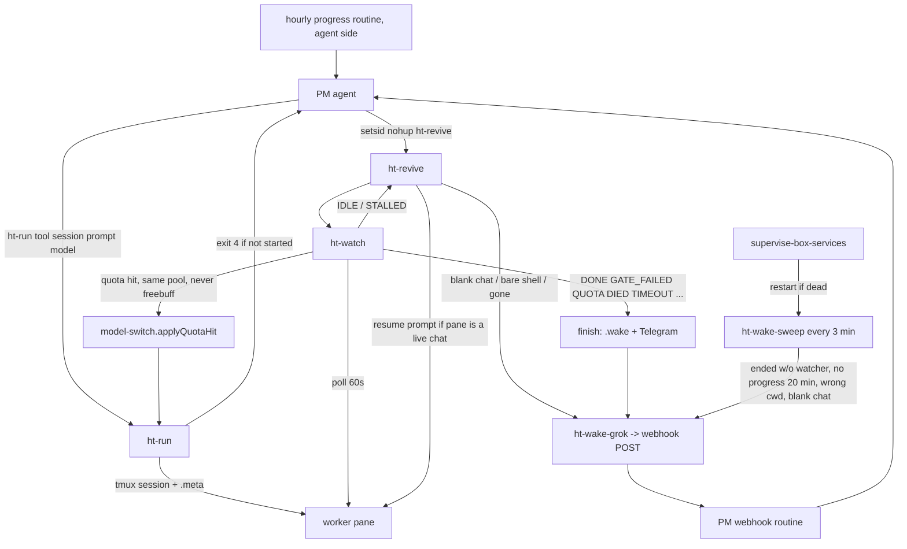

# Worker notifications playbook

How the box makes sure the PM agent hears about every worker that finishes, fails or gets stuck,
and how to set up the same thing on a VM bot. Written 2026-10-10 after a day of missed wakes.

## (a) Goal

The PM agent (Grok Bot, "Browser agent") must be woken on **every** end state and **every** stuck
state of **any** worker, without the user having to remind it. "Stuck" counts as much as "finished":
a worker sitting at a blank chat, in the wrong directory, or not touching any file for 20 minutes is
a state the PM must hear about, even if its watcher process is still alive and thinks all is well.

Two rules follow from that:

1. Every terminal path of every watcher ends in one function that pings Telegram AND wakes the PM.
2. A separate, dumb safety net (the sweeper) checks the result on disk and on screen every 3 minutes,
   independently of the watchers, and wakes the PM when nothing is moving.

## (b) Architecture

### Pieces

| Piece | File | What it does |
|---|---|---|
| Launcher | `/home/box/bin/ht-run <tool> <session> <prompt-file> [model\|@pool]` | Starts the worker (freebuff, opencode or cline) in tmux session `<session>`, logs the pane to `/workspace/logs/<session>.log`, writes `/workspace/logs/<session>.meta` (tool, model, prompt_file, workspace, startedAt). Since 2026-10-10 it **fails (exit 4)** when the run did not really start: Freebuff prompt not accepted, or the opencode/cline run exited straight away. It refuses to start a second Freebuff session while another live tmux session holds one. |
| Watcher | `/home/box/bin/ht-watch <session> <report> [hours]` | Polls every 60 s. Silent while healthy. Exits with ONE verdict through `finish()`, which writes `/workspace/logs/<session>.wake`, sends ONE Telegram message and calls `ht-wake-grok`. |
| Finish gate | `<job-dir>/GATE.sh` | If present, must exit 0 before `DONE` is accepted. A failing gate renames REPORT.md to `REPORT.rejected-N.md`, writes `GATE-FAIL.txt`, types the reason to the worker. The 3rd failure is `GATE_FAILED`. A REPORT.md whose first line says `STATUS: IN PROGRESS`/`PARTIAL`/`WIP` is treated as a progress note and is not gated. |
| Reviver | `/home/box/bin/ht-revive <session> <report> <hours> [max=6]` | Runs `ht-watch` in a loop. On `IDLE`/`STALLED` it types a resume prompt into the pane (max 6 times, then `REVIVE_CAP`). Since 2026-10-10 it **refuses** to type into a session that is gone, a finished run, a blank "New chat" or a bare shell prompt, and wakes the PM with `EXITED: ... not revivable (...)` instead. |
| Wake | `/home/box/bin/ht-wake-grok <session> <verdict>` | POSTs `{"session","verdict"}` to the PM's webhook routine ("Worker job finished"). |
| Safety net | `/home/box/bin/ht-wake-sweep` (loop every 3 min; `--dry-run` = one pass, print only) | (1) exited-without-watcher: pane back at a shell / run finished / REPORT says `STATUS: COMPLETE` and no `ht-watch` alive → wake once per job start. (2) NO-PROGRESS, runs even when a watcher is alive: no file in the job dir changed for 20 min (`prof*`/`chrome*` excluded; launch time counts as activity), OR pane cwd / tool footer is not the job dir, OR pane shows a blank "New chat" → `EXITED: no progress 20 min (<reason>)`, at most once per 45 min per session. |
| Supervisor | `/home/box/bin/supervise-box-services` | No systemd/cron on the box. This loop restarts `ht-wake-sweep`, `ht-model-guard`, the router, opencode serve etc. when they die. |
| Tabs | `/home/box/bin/ht-tab-guard`, `ht-tabs`, `ht-show` | Keep every `ht-*` session visible on the desktop. Note: `ht-tab-guard` recreates idle `ht-freebuff`/`ht-opencode`/`ht-opencode2` placeholder shells; the sweeper ignores a session whose tmux creation time is newer than its `.meta` (stale meta). |
| Lanes | `ht-free-now`, `ht-model`, `ht-allowance-watch`, repo `scripts/lib/model-switch.mjs` | Which free model lanes are usable; the in-job quota switch. |
| Agent side | PM routines | (1) webhook routine "Worker job finished" — woken by `ht-wake-grok`; (2) an hourly progress routine on the agent side that reads `/workspace/logs/*.wake`, `*.watch.log` and `ht-wake-sweep.log` and nudges the PM when a job has been quiet. These live in the agent's routine settings, not on the box. |

### ht-watch verdicts

| Verdict | Meaning | Wakes PM? |
|---|---|---|
| `DONE` | REPORT.md written and GATE.sh (if any) passed | yes |
| `GATE_FAILED` | 3 finish-gate failures | yes |
| `IDLE` | Freebuff not "working" for 5 min, no report | handled by ht-revive (silent); if not revivable → `EXITED` (yes) |
| `STALLED` | pane blank or unchanged 30 min | same as IDLE |
| `QUOTA` | lane quota hit AND the pool has no other usable multi-session lane (otherwise the watcher switches lanes silently) | yes |
| `DIED` | tmux session gone without a report | yes |
| `SESSION_LOST` | Freebuff continue failed 3x or account taken over | yes |
| `TIMEOUT` | still running after max hours (fractional hours allowed, min 10 min) | yes |
| `REVIVE_CAP` | ht-revive gave up after N revives | yes (+ Telegram) |
| `CONTINUE_CAP` | 12 Freebuff auto-continues used | yes |
| `FAILOVER_EXHAUSTED` | `--auto-failover` found no lane left | yes |
| `EXITED: ...` | from ht-revive (not revivable) or ht-wake-sweep (ended without watcher / no progress) | yes |

`ht-wake-grok` wakes on: `DONE*`, `GATE_FAILED*`, `SESSION_LOST*`, `QUOTA*`, `DIED*`, `REVIVE_CAP*`,
`CONTINUE_CAP*`, `TIMEOUT*`, `EXITED*`, `FAILOVER_EXHAUSTED*`. Anything else (bare `IDLE`/`STALLED`) stays quiet
because ht-revive handles it first.

### Flow

### Config and env locations (values are secrets — never print them)

| What | Where | Variables |
|---|---|---|
| PM webhook | `~/.config/ht-wake/env` (sourced by `ht-wake-grok`) | `HT_WAKE_WEBHOOK_URL`, `HT_WAKE_WEBHOOK_AUTH` (Bearer/Basic/full `Authorization:` header) |
| Telegram | `~/.config/telegram-opencode/router/.env` | `TELEGRAM_BOT_TOKEN`, `TELEGRAM_ALLOWED_USER_ID` (Bot API `sendMessage` only; never a second poller) |
| Lane ledger | `~/.config/telegram-opencode/router/state/free-lane-table.json`, `session.json` | written atomically by `ht-allowance-watch`, `ht-model quota-hit`, `ht-watch` |
| Logs | `/workspace/logs/` | `<session>.log` (pane), `.meta`, `.wake` (last verdict), `.watch.log`, `.revive.out`, `.relaunch.out`, `.gatefails`, `ht-wake-sweep.log`, `wake-sweep/` (stamps) |
| Tabs | `~/.config/ht-tabs.conf` | `HT_TABS_DISPLAYS` |
| Knobs | env of ht-watch/ht-run/ht-wake-sweep | `HT_WORKSPACE`, `HT_BIN_DIR`, `HT_AC_LOGS_DIR`, `HT_ROUTER_DIR`, `HT_WATCH_POLL_SECS`, `HT_WATCH_IDLE_SECS`, `HT_WATCH_STALLED_SECS`, `HT_WATCH_NO_TG`, `HT_DRY_RUN`, `HT_RUN_VERIFY_SECS`, `HT_OC_PERMISSION` (e.g. `{"external_directory":"allow"}` for opencode jobs that must touch dirs outside their cwd), `HT_NOPROG_MIN` (20), `HT_NOPROG_EVERY_MIN` (45) |

## (c) Failure log, 2026-10-10

1. **TIMEOUT did not wake the PM.** Cause: `ht-wake-grok` only let `DONE`/`GATE_FAILED` through (an
   earlier "don't spend quota on churn" rule), so TIMEOUT/DIED/QUOTA/... only reached Telegram. Fix:
   all terminal verdicts plus `EXITED*` now wake (`ht-wake-grok`, backup `.bak-prestall-20261010`).
2. **Watcher died on fractional hours (`2.5`).** Cause: `$(( maxh * 3600 ))` is integer-only bash math,
   so `2.5` was a syntax error and the watcher exited at once — nothing watched the job. Fix: awk
   computes seconds, floor 10 min (`ht-watch`, backup `.bak-prefrac-20261010`).
3. **A worker's own `pkill -f` killed its shell.** Cause: `pkill -f chrome` (or similar) matches any
   process whose command line contains the word — including the worker's own `bash -lc '... chrome ...'`
   wrapper, whose prompt mentions Chrome. Fix: rule — kill by PID only (`kill $(cat chrome.pid)`);
   prompts say so explicitly.
4. **Chrome blank pages.** Cause: headless Chrome launched without `--proxy-server=http://127.0.0.1:8791`
   has no working egress for those sites and renders blank pages that look like "no results". Fix: the
   launch line in every flight prompt carries the proxy flag; a blank page is a failure, not a result.
5. **Quota auto-switch moved 3 jobs onto Freebuff, in the wrong dir, at a blank chat (12:23).**
   Root cause: (i) `model-switch.quotaHitPlan` picked the next lane of the pool with no tool filter, and
   the top-rated coding lane was a Freebuff lane — so all three jobs that hit the shared OpenCode Zen
   bucket at the same moment were sent to Freebuff, which allows ONE CLI session per login and had
   12 Freebucks left at 15/hr. (ii) `ht-watch` relaunched via `ht-run` without `HT_WORKSPACE`, so
   `ht-run` used its default (`/workspace/biomarker-and-nutrient-tracker`) instead of the job dir.
   (iii) `ht-run freebuff` printed "CHECK: prompt may not have been accepted" but exited 0, so the
   blank chat counted as a successful relaunch; Freebuff takes no model, so the meta said `model ""`.
   (iv) "Stamped until 12:08:18Z" logged at 12:23:18 looked past-dated but was not: the log prefix is
   local BST (UTC+1), the stamp is UTC, i.e. 13:08:18 BST = +45 min. The log line was ambiguous.
   Fix: `model-switch.mjs` gains `SINGLE_SESSION_TOOLS = ['freebuff']` and an `avoidTools` option that
   `quotaHitPlan`/`applyQuotaHit`/`nextPoolLane` default to — an automated switch never lands on
   Freebuff (an explicit launch still can); `ht-run` refuses a 2nd Freebuff session, fails (exit 4) when
   the prompt was not accepted or the run exited immediately, records `workspace` in `.meta`, resets
   the gate counter on a fresh launch; `ht-watch` relaunches with `cd <job dir>` + `HT_WORKSPACE=<job dir>`
   (meta `workspace`, else the prompt file's dir), propagates ht-run's exit code (a failed relaunch ends
   in `QUOTA ... relaunch failed`, which wakes), and logs the stamp in local time AND UTC. Test 9 in
   `/home/box/bin/tests/ht-model.test.sh` reproduces the bug against the old module and passes on the new.
6. **Revive typed resume prompts into blank chats / bare shells, so nothing looked dead.** Cause: after
   `IDLE` ht-revive always typed the resume prompt; typing changed the screen, so STALLED never fired
   and no wake went out. Fix: ht-revive checks the pane first (gone / `finished (exit` / blank New chat /
   bare `$` prompt) and wakes the PM with `EXITED: ... not revivable` instead.
7. **Space Bunny (404) still listed as live in `ht-free-now`.** Cause: the lane was last probed OK at
   05:52; nobody stamped it when the vendor started returning 404 "No endpoints found", so the list and
   the auto-pick kept offering it (ht-opencode died on it at 07:15 and sat there for 5 hours). Fix:
   stamped depleted via `ht-model quota-hit`; the no-progress sweep now flags such a dead pane within
   20 min. Same treatment for Cline Gemini 3.8 Flash and Token Harbor Qwen3.8 Flash (free offers ended).
   Lesson: `ht-model quota-hit` on a Token Harbor lane stamps the whole shared `tokenharbor-free`
   bucket — for a single model whose promo ended, stamp the lane only.
8. **Nudges typed into a bare shell after the worker had exited.** Cause: the PM (and ht-revive) sent
   keys to a tmux pane without checking that a worker was still running there; the text went to bash.
   Fix: check `tmux capture-pane` for `=== <session> finished` / a shell prompt before typing; ht-revive
   now does; the sweeper reports exited workers.
9. **Bonus, ideate3:** a worker writing partial progress to REPORT.md burnt its 3 finish-gate attempts
   (stale `.gatefails` counter from an earlier run + progress notes gated as final). Fix: `STATUS: IN
   PROGRESS` reports are not gated; `ht-run` clears `.gatefails` on launch.

## (d) Rules for workers (put these in every prompt)

- Kill processes **by PID only** (`kill $(cat chrome.pid)`). Never `pkill -f`/`killall` with a pattern.
- Browser checks: a brand-new, cookie-free profile per check (`rm -rf` the `--user-data-dir` first, or
  `--incognito`); curl without a cookie jar; Chrome always with `--proxy-server=http://127.0.0.1:8791`.
- Work only in the job dir; write partial progress as you go (REPORT.md first line
  `STATUS: IN PROGRESS`, plus PROGRESS.md / capture files) so a relaunch can build on it.
- If one fetch hangs > 2 min, skip it and note it.
- Before finishing, run `GATE.sh` yourself until it exits 0, then put `STATUS: COMPLETE` on line 1.
- Never claim done otherwise. Never invent data.

## (e) Setup checklist for a new VM bot

1. Copy to `~/bin` (or `/home/box/bin`): `ht-run`, `ht-watch`, `ht-revive`, `ht-wake-grok`,
   `ht-wake-sweep`, `ht-free-now`, `ht-model`, `ht-allowance-watch`, `ht-show`, `ht-tabs`, `ht-tab-guard`,
   `supervise-box-services`, `tests/ht-model.test.sh`. Copy the repo (for `scripts/lib/model-switch.mjs`,
   `scripts/ht-model.mjs`, `tools/telegram-provider-router/src/allowance-watch-core.cjs`).
2. Adapt paths: `/home/box/bin` and `/workspace/logs` are absolute in the box copies; set `HT_BIN_DIR`,
   `HT_AC_LOGS_DIR`, `HT_ROUTER_DIR`, `HT_TOOL_REPO` or edit the defaults. `mkdir -p` the logs dir.
3. Webhook: create the PM's webhook routine ("Worker job finished") in the agent; put its URL and auth
   into `~/.config/ht-wake/env` as `HT_WAKE_WEBHOOK_URL=` / `HT_WAKE_WEBHOOK_AUTH=`; `chmod 600`.
4. Telegram: `TELEGRAM_BOT_TOKEN` and `TELEGRAM_ALLOWED_USER_ID` in the router `.env` (or set
   `HT_WATCH_NO_TG=1` if the VM has no Telegram).
5. Create the agent-side hourly progress routine (reads `.wake`, `*.watch.log`, `ht-wake-sweep.log`).
6. Start the supervisor once (no boot hook without root): `setsid nohup ~/bin/supervise-box-services >/dev/null 2>&1 &`;
   confirm `pgrep -f ht-wake-sweep`.
7. Launch jobs only like this:
   `cd <jobdir>; HT_WORKSPACE=<jobdir> ht-run <tool> <session> <prompt> <model>` then
   `setsid nohup ht-revive <session> <jobdir>/REPORT.md <hours> &`, and check the pane within 60 s.

### Test procedure (prove each path wakes the PM)

Use a throwaway session name and `HT_WATCH_POLL_SECS=5`; watch the webhook routine fire.

- Webhook itself: `ht-wake-grok ht-test "DONE: test"` → prints `200`/`2xx`; the PM routine runs.
  `ht-wake-grok ht-test "IDLE: test"` → prints nothing (stays quiet by design).
- Each verdict class: `for v in DONE GATE_FAILED QUOTA DIED TIMEOUT SESSION_LOST REVIVE_CAP CONTINUE_CAP FAILOVER_EXHAUSTED EXITED; do ht-wake-grok ht-test "$v: wake test"; done` → 10 wakes.
- DIED: start `ht-run opencode ht-test p.txt <model>` + `ht-watch ht-test /tmp/x/REPORT.md 0.2`, then
  `tmux kill-session -t ht-test` → `DIED` within one poll.
- TIMEOUT (fractional hours): `ht-watch ht-test /tmp/x/REPORT.md 0.17` on a long job → `TIMEOUT` after 10 min.
- GATE_FAILED: job dir with `GATE.sh` = `exit 1`; write REPORT.md three times.
- Launch verification: `HT_DRY_RUN=1 ht-run freebuff ht-x p.txt` while another Freebuff session runs →
  `FAIL: freebuff is single-session ...` exit 4.
- Quota switch: `bash tests/ht-model.test.sh` → `ALL PASS` (test 9 = never switch to Freebuff, stamp in the future).
- Sweeper: `ht-wake-sweep --dry-run` lists `ok <session>` or `WOULD WAKE <session> -> ...` for every
  `ht-*` session without waking anything. To see the no-progress path fire, make a session whose pane
  shows `Chat: New chat` in the wrong cwd with a fresh `.meta` (startedAt = now) and run
  `HT_NOPROG_MIN=0 ht-wake-sweep --dry-run`.
