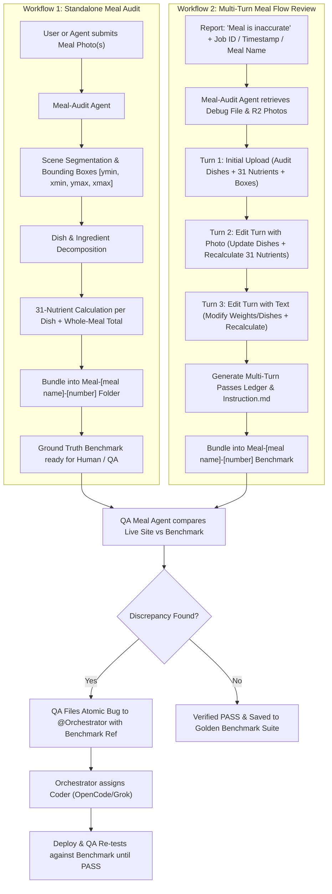

# Comprehensive Architecture & Implementation Plan: Meal-Audit Bot & Multi-Turn Flow Reviewer

## 1. Executive Summary & Vision

The **Meal-Audit Bot** (`meal-audit`) is an audit-grade AI nutrition engine designed to produce authoritative, clinically verified ground truth benchmarks for food analysis. It can be invoked directly by human users or autonomously by other agents (such as `@Meal_journey_QA_bot` or `@Orchestrator`).

Every meal audit produces a self-contained benchmark folder named according to the standard convention:
$$\text{Meal-[meal name]-[number]}$$
*(e.g. `Meal-Salmon-Bowl-01`, `Meal-Chicken-Hotpot-02`)*

This folder bundles all evidence images, multi-turn user instructions, visual bounding boxes, and the complete **31-nutrient ledger** for every turn. It serves as an immutable ground truth for:
1. Verifying meal logging accuracy on the live site.
2. Replaying multi-turn meal editing flows (e.g. photo edit + text clarification).
3. Feeding reproducible regression test suites in `golden/meal/Meal_04_log/`.

---

## 2. The Two Core Operating Workflows



---

### Workflow 1: Standalone Meal Audit
*Triggered when a human or agent submits raw meal photos to audit.*

1. **Ingestion**: Receives 1 or more meal photos with optional notes.
2. **Visual Grounding**:
   - Detects every plate, bowl, container, side, or beverage.
   - Assigns normalized 2D bounding boxes `[ymin, xmin, ymax, xmax]` ($0..1000$ scale).
3. **Decomposition**: Splits each dish into ingredients, cooking methods (`grilled`, `steamed`, `fried`, `raw`, `simmered`), and gram estimates.
4. **31-Nutrient Calculation**: Resolves all 31 nutrients for each dish and whole-meal totals.
5. **Bundling**: Packages all artifacts into `Meal-[meal name]-[number]/`.

---

### Workflow 2: Meal Flow Review (Reconstructing Multi-Turn Meal Logs)
*Triggered when a user or QA agent reports a meal inaccuracy on the live site.*

1. **Locating the Meal & Debug Payload**:
   - The agent accesses the saved meal or in-progress meal via:
     - **Exact Timestamp** (e.g. `Sept 22 08:21` or `2026-09-22T08:21:00Z`)
     - **Meal Name** (e.g. `Chicken Hotpot`)
     - **Job ID** (e.g. `job_1787301189340_b7oux316g` or `golden_...`)
     - Or a local debug file (`debug-job_....md` / `debug.json`).
   - Retrieves the full debug record via the internal API (`/api/jobs/debug?jobId=...`) or DB query:
     - Downloads all original uploaded photos from R2 storage.
     - Parses `sessionEvents` to extract user text prompts and actions for every turn.
2. **Turn-by-Turn State Reconstruction**:
   - **Turn 1 (Initial Intake)**:
     - Input: Initial photo(s) + initial prompt.
     - Computes: Initial dish segmentation, bounding boxes, and Turn 1 31-nutrient ledger.
   - **Turn 2 (Photo Clarification / Add-on)**:
     - Input: New photo added + user clarification (e.g. *"this is chicken and I ate less peanuts"*).
     - Computes: Replaces or scales dishes, adds new bounding boxes, recalculates Turn 2 31-nutrient ledger.
   - **Turn 3 (Text-only Portion / Ingredient Edit)**:
     - Input: User text modification (e.g. *"steak was 250g, no sauce, didn't drink the beer"*).
     - Computes: Removes deleted items, scales weights, recalculates Turn 3 31-nutrient ledger.
3. **Multi-Turn Ground Truth Ledger**:
   - Generates an audit document containing **all 3 sets of full 31-nutrient ledgers and dishes**, showing exact state evolution at each turn.
4. **Bundling**: Saves into `Meal-[meal name]-[number]/` with all turn photos (`turn1_...`, `turn2_...`).

---

## 3. The Bundle Standard: `Meal-[meal name]-[number]`

Every audit folder follows a standardized structure:

```
Meal-[meal name]-[number]/
├── meal_result.json        # Canonical typed ledger (with passes[] for multi-turn)
├── meal_result.md          # Human-readable executive audit report
├── meal_annotated.svg      # Visual bounding box overlay map
├── Instruction.md          # Multi-turn user prompts, actions, and expectations
├── photos/                 # Local copies of all source evidence photos
│   ├── turn1_plate.jpg
│   ├── turn1_side.jpg
│   └── turn2_clarification.jpg
└── expected.json           # Golden benchmark contract (compatible with Meal_04_log)
```

### `meal_result.json` Multi-Turn Schema

```typescript
export interface MultiTurnMealAuditResult {
  schemaVersion: "2.0.0";
  bundleName: string;          // e.g. "Meal-Chicken-Hotpot-02"
  mealId: string;
  createdAt: string;
  title: string;
  mode: "single_audit" | "multi_turn_flow";
  
  // Array of turns / passes
  passes: Array<{
    turnIndex: number;
    turnId: string;            // e.g. "turn_1_initial", "turn_2_photo_edit", "turn_3_text_scale"
    userPrompt: string;        // User's instruction in this turn
    addedPhotos: string[];     // Photos introduced in this turn
    cumulativePhotos: string[];// All active photos up to this turn
    totalWeightGrams: number;
    dishes: DishAudit[];       // Dishes present at this turn (with bounding boxes)
    mealTotals: Nutrients31;   // Complete 31-nutrient ledger for this turn
    energyVerification: {
      declaredCalories: number;
      atwaterCalories: number;
      differencePercent: number;
      isBalanced: boolean;
    };
  }>;

  // Final consolidated outcome
  finalSummary: {
    totalTurns: number;
    finalWeightGrams: number;
    finalCalories: number;
    finalNutrients: Nutrients31;
    clinicalObservations: string[];
  };
}
```

---

## 4. The 4-Agent Collaboration Cycle

```
[User / Human Tester]
         │
         ▼
[QA Meal Agent] ──(Obvious UI/CSS/Float bug)──► [@Orchestrator]
         │                                            │
         │ (Food Inaccuracy / Wrong Dishes /          ▼
         │  Multi-Turn Edit Discrepancy)       [Coding Agent]
         ▼                                     (OpenCode/Grok)
[Meal Audit Agent]                                    │
   - Fetches debug payload & R2 photos                │
   - Audits all turns (dishes, boxes, 31 nutrients)   │
   - Emits Meal-[name]-[number] benchmark             │
         │                                            │
         ▼                                            ▼
[QA Meal Agent] ◄───(Runs Journey vs Benchmark)───────┘
   - Verifies fix against Meal-[name]-[number]
   - Iterates until 100% PASS
```

### Step 1 — Triage by QA Meal Agent
When a user submits a bug or flags an inaccurate meal:
- **Fast Path (UI/Theme/Formatting Defect)**: If the issue is simple formatting (e.g. `7.700000000000001g` floating-point artifact or CSS color), QA Meal immediately files an atomic ticket to `@Orchestrator`.
- **Deep Path (Food/Nutritional Inaccuracy)**: If the meal was recognized wrongly, an ingredient was hallucinated, portions are distorted, or multi-turn edits failed to update macros, QA Meal delegates to **`@Meal_Audit_bot`**:
  `"Audit meal: Timestamp 'Sept 22 08:21', Name 'Salmon Bowl', Job ID 'job_xxx'"`

### Step 2 — Audit & Benchmark Generation
- The **Meal Audit Agent** fetches the session events and photos.
- Reconstructs every turn and computes the ground truth 31-nutrient ledger.
- Generates the benchmark folder: `Meal-Salmon-Bowl-01/`.
- Replies to QA Meal with the benchmark path and summary.

### Step 3 — Verification & Iterative Resolution
- The **QA Meal Agent** runs the Playwright/HTTP journey test feeding the exact photos and prompts from `Instruction.md`.
- Compares the live site output against `expected.json` / `meal_result.json`.
- If the live site diverges:
  - QA Meal logs an atomic defect ticket pointing to the exact discrepancy (e.g. *"Turn 2: Salmon was scaled to 200g in benchmark, but live site kept 160g"*).
  - `@Orchestrator` assigns a coder (OpenCode/Grok) to refine the backend prompt / vision critic in `server_vision_scout.ts`.
  - QA Meal re-tests against the benchmark folder until it passes.

---

## 5. Technical Implementation Plan

### Phase 1: Multi-Turn & Bundle Support in `scripts/generate-meal-result.mjs`
- Enhance `scripts/generate-meal-result.mjs` to accept multi-turn payloads (`passes: [...]`).
- Implement `--bundle-name="Meal-[name]-[number]"` parameter.
- Automatically copy source photos into `photos/` within the bundle directory.
- Generate `Instruction.md` documenting user instructions per turn.

### Phase 2: Debug Retrieval Tool (`scripts/meal-audit-fetch.mjs`)
- Build a CLI helper to locate and extract meal debug files:
  ```bash
  node scripts/meal-audit-fetch.mjs \
    [--job-id="job_..."] \
    [--timestamp="2026-09-22 08:21"] \
    [--name="salmon"] \
    [--output-dir="artifacts/fetched_debug/"]
  ```
- Queries local D1/SQLite or remote `/api/jobs/debug` endpoint to download photos and session logs.

### Phase 3: Update `meal-audit-engine` Skill & Hermes Profile
- Update [`scripts/skills/meal-audit-engine/SKILL.md`](file:///root/Health-tracker/scripts/skills/meal-audit-engine/SKILL.md) with:
  - Workflow 1 (Standalone Image Audit) instructions.
  - Workflow 2 (Multi-turn Debug Flow Review) instructions.
  - Bounding box standards (`0..1000`) and 31-nutrient mapping rules.

### Phase 4: Update `qa-meal-journey` Skill
- Update [`scripts/skills/qa-meal-journey/SKILL.md`](file:///root/Health-tracker/scripts/skills/qa-meal-journey/SKILL.md) to add **Workflow C: Meal Inaccuracy Triage & Delegation**:
  - Distinguishes UI/visual defects from nutritional/vision defects.
  - Delegates nutritional defects to `@Meal_Audit_bot`.
  - Re-tests against the resulting `Meal-[name]-[number]` bundle.

### Phase 5: End-to-End Verification
- Test Workflow 1 on a standalone photo.
- Test Workflow 2 using a multi-turn case from `tests/Golden_meal/10. Photo edit clarifies one dish`.
- Verify TypeScript check (`npx tsc --noEmit`) passes cleanly.
