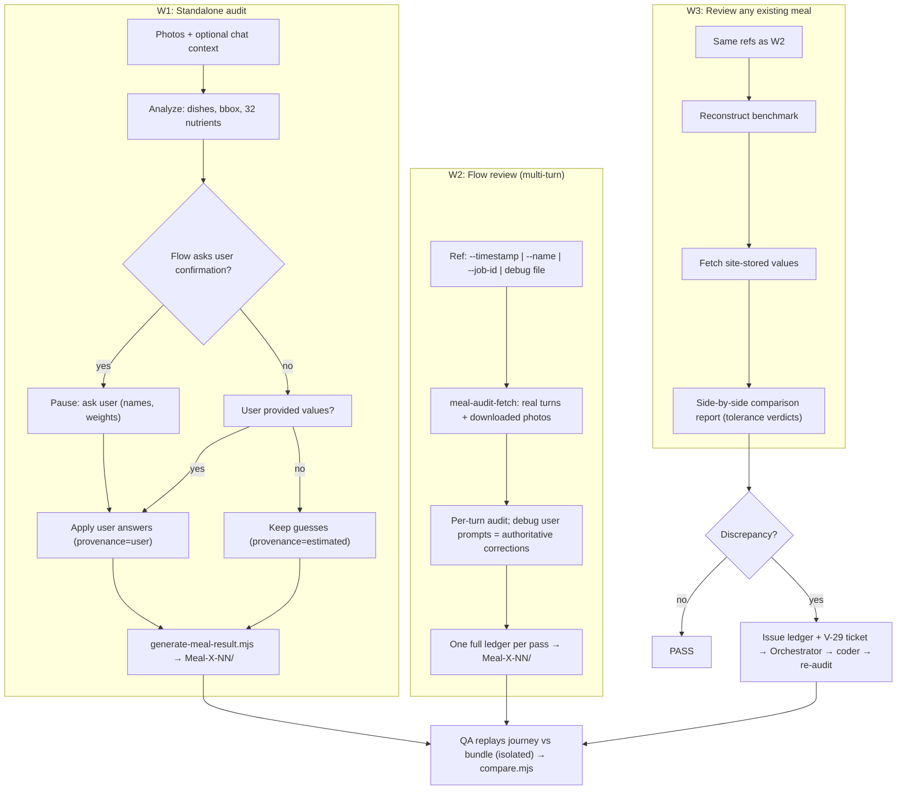

# Meal-Audit Bot — Plan v3

> Status: **DONE** — P0–P6 complete in proot (P6: suite report + issues + calibrate + E2E W1/W2 PASS). VPS handoff 2026-09-22: profile provisioned, skills synced, gateway restarted (meal_audit multiplexed), MAI-001 verified, fixtures seeded, calibrate=100. Remaining human: dedicated TELEGRAM_BOT_TOKEN then live phone MEDIA: E2E. Supersedes v1/v2. v2 incorrectly claimed the
> implementation was "already built, tested, and deployed" — see §8 Historical Claims.

The Meal-Audit Bot (`meal_audit`) is a **standalone, on-demand benchmark agent**.
It reviews meals (raw photos, multi-turn site flows, or any already-saved meal),
produces an authoritative ground-truth report, and bundles it as
`Meal-[meal name]-[number]/` for QA comparison.

It is **not** part of `golden/meal/`. Golden meal is a static regression suite;
this bot is a separate process that audits meals as they come along and tracks
discovered bugs in its own issue ledger (§6).

---

## 1. Design principles

1. **User-input led, vision assisted.** Values the user provides in chat are
   authoritative. Values the meal flow asks the user to confirm are confirmed
   interactively. Only when the user does not provide/confirm does the bot guess
   (OCR/label → nutrient DB → vision estimate). Every number carries provenance.
2. **Honesty over false precision.** Missing debug data aborts loudly; placeholder
   ground truth is forbidden. Guesses are marked `confidence: estimated`.
3. **Deterministic bundles.** Golden outputs normalize unstable fields (clock, IDs,
   paths, float jitter) at write time; diffs are the review surface.
4. **Separation of concerns.** Writes only under `artifacts/meal_audits/`.
   Never touches `golden/meal/` unless the user explicitly promotes a bundle.
5. **Contamination isolation.** The system under test (live-site journey replay)
   must never read `expected.json` / `meal_result.json` during a run.
6. **Harness disclosure.** Every bundle records `generatedBy {model, promptVersion,
   date}`; every comparison records site SHA + model. Scores without a harness card
   are meaningless.
7. **Type-dependent tolerance.** See §3. Exact where exactness is possible,
   percentage bands where estimation is inherent.

## 2. The three workflows



- **W1 — Standalone audit.** Human/agent submits photos (+ chat context).
  Where the product's meal flow explicitly asks the user for confirmation, the
  audit bot **pauses and asks too**, and the user may volunteer weights/values.
  User answers overwrite guesses and are recorded per-pass.
- **W2 — Multi-turn flow review.** Locate by timestamp, meal name, job id, or a
  local debug file. Fetcher reconstructs turns (initial upload → photo edit →
  text edit) with **photos downloaded to disk**. Debug user prompts are treated
  as authoritative corrections. Output: one full 32-nutrient ledger + dish set +
  associated images **per turn** (1 upload + 2 edits ⇒ 3 passes).
- **W3 — Existing-meal report.** Same inputs as W2, but the deliverable is the
  **comparison report**: benchmark values vs site-stored values, per key, with
  tolerance verdicts — directly usable to decide whether a meal is wrong.

Both W1/W2 feed the QA loop: QA Meal replays the journey against the bundle
(isolated), `meal-audit-compare.mjs` scores it, failures land in the issue ledger.

## 3. Tolerance matrix (comparison contract)

| Check | Tolerance | Rule |
|---|---|---|
| OCR / label text | **0%** | Exact after whitespace trim |
| Meal / dish name | **Exact** | Normalize case/punct/spacing; acronyms match only via explicit `aliases[]` — no fuzzy guessing |
| Core nutrients (repo `CORE_NUTRIENT_KEYS`, 10 keys: calories, protein, carbohydrates, solubleFibre, saturatedFat, transFat, addedSugar, totalFibre, sodium, potassium) | **≤10%** | Per-key % error vs benchmark |
| Remaining nutrients (the other 22 of 32) | **≤30%** | Per-key; always report actuals |
| Total weight | **≤10%** | Core-tier |
| Bounding box (only when photos exist) | **IoU ≥ 0.5** | `[ymin,xmin,ymax,xmax]` in 0..1000 |
| Atwater energy balance | **≤10%** | Pre-diff invariant, always runs |
| Turn structure | **Exact** | Wrong turn count / photo attribution ⇒ **DIVERGED** (not a nutrient FAIL) |

**Canonical nutrient set = 32 keys** (`src/utils/nutrients.ts NUTRIENT_KEYS`).
Historical "31" was an off-by-one (`sugar` was added later); `salt` is a
display-derived 33rd and is not part of the ledger.

Outcomes: `PASS` | `FAIL(code)` | `DIVERGED`. Failure taxonomy codes:
`name_mismatch, portion_bias, core_nutrient_drift, micro_nutrient_drift,
bbox_drift, edit_not_applied, turn_mismatch, ocr_error`.

Every comparison output carries a harness card:
`{bundleName, siteSha, scoutModel, toleranceTier, generatedBy, comparedAt}`.

## 4. Provenance & confidence (per nutrient value / dish field)

Priority order — first non-empty wins:

1. `user_confirmed` — user answered the bot's pause-for-confirmation question.
2. `user_provided` — user volunteered the value in chat.
3. `ocr_label` — read from an on-image label / package (W1: highest machine tier).
4. `user_instruction` — from debug conversation (W2 edits; authoritative for edits).
5. `nutrient_db` — looked up from brand/USDA-style DB by identified food.
6. `vision_estimate` — model guess.

`meal_result.json` records `provenance` + `confidence: exact|estimated` per dish
and for meal totals. FINAL status requires no `estimated` values in core
nutrients; otherwise the bundle is marked `DRAFT` with the gaps listed.

### Pause-for-confirmation protocol (W1)

Trigger: the underlying meal flow asks the user to confirm a dish/weight, OR the
estimate's confidence is low for a core nutrient. The bot sends one message
listing uncertain items and possible weights, waits for the reply (bounded, e.g.
5 min), records answers as `user_confirmed`, then proceeds. If the user skips,
proceeds with `vision_estimate` + `DRAFT` flag. The pause and its outcome are
written into `Instruction.md` and the pass's `userPrompt`.

## 5. Bundle standard `Meal-[meal name]-[number]`

```
Meal-<slug>-NN/            # NN = 01, 02… collision-safe (auto-increment)
├── meal_result.json       # canonical ledger; passes[] for multi-turn;
│                          # provenance, confidence, generatedBy harness card
├── meal_result.md         # human report: dishes, bbox, 32-nutrient tables,
│                          # Atwater check, sources, W3 comparison table
├── Instruction.md         # per-pass replay instructions + pause/confirm record
├── expected.json          # QA contract: tolerances{}, passes, expectedItems
├── comparison.json        # (W3/after QA) verdicts per key + taxonomy codes
├── meal_annotated[_turnN].svg
└── photos/                # LOCAL files (fetcher downloads; never bare URLs)
```

Determinism rules for writers: fixed/derived clock, stable key order, 1-decimal
floats, project-relative paths, no absolute host paths, no secrets/PII.
Photos are EXIF/GPS-scrubbed before they can ever reach git.

## 6. Issue ledger (bugs outside golden)

`artifacts/meal_audits/issue_ledger.jsonl` — one JSON line per finding:

```json
{"id":"MAI-YYYYMMDD-NNN","bundle":"Meal-X-01","turn":2,
 "taxonomy":"core_nutrient_drift","key":"protein","expected":46.5,"actual":38.1,
 "deltaPct":18.1,"status":"open|ticketed|fixed|verified|closed",
 "bugId":"BUG-…","createdAt":"…","resolvedAt":null}
```

Lifecycle: `audit → compare → FAIL → ledger(open) → V-29 atomic ticket to
@Orchestrator → coder fixes → re-audit → PASS → ledger(verified) → closed`.
Open issues are queryable from the bot on Telegram (`/issues`). Promotion of a
bundle into `golden/meal/` happens only on explicit user request — never as an
automatic side effect.

## 7. Model strategy

- **Start free:** run on the free Hermes model available to the `meal_audit`
  profile. Record model id in `generatedBy` on every bundle.
- **Calibrate (P6):** score N audits against user-confirmed values using the
  tolerance matrix → report accuracy per model. If core-nutrient pass rate is
  below target, switch the profile's model and re-calibrate.
- Model swaps are config-only; bundles already emitted keep their harness card.

## 8. Historical claims (correcting v2)

v2 asserted the plan was "already been built, tested, committed … and deployed."
Verified 2026-09-22: committed `6a04b42` **yes**; tested **no** (zero test
coverage); built **partially** (fetcher broken: `--timestamp` ignored, wrong
event types, no photo download, placeholder dishes on failure); deployed
**unverified**; Hermes profile **not provisioned**. This v3 replaces those claims
with the phase table below, each with an exit criterion.

## 9. Phases

| Phase | Work | Exit criterion |
|---|---|---|
| **P0** | Reconcile 31→32 everywhere; rename stray bundle; privacy rule (EXIF/PII scrub before git); document scope separation | `grep -r "31-nutrient"` clean in plan/skill/generator; no PII path in committed files |
| **P1** | Fix fetcher: `--timestamp` queries for real; turns via `buildTurnTimeline`/`resolveTurnImages`; photos downloaded to disk; fail loud (no synthetic ids, no placeholder dishes) | Timestamp lookup returns a real jobId or exits 2 listing candidates; `photos/` non-empty; missing debug ⇒ exit 1 |
| **P2** | Payload contract doc; provenance tiers + pause protocol in SKILL; inbound `MEDIA:` photo path; `generatedBy` model field | Contract doc exists; fixture validates; SKILL describes pause flow |
| **P3** ✅ | Generator gates: bbox required iff photos; all 32 keys; collision-safe numbering; determinism normalization; pre-diff invariant layer | Invalid payload throws; regenerating a golden yields a review-sized diff |
| **P4** ✅ | `scripts/meal-audit-compare.mjs`: tolerance matrix, MAE/%MAE + IoU, PASS/FAIL/DIVERGED, taxonomy, harness card | Forced-wrong payload ⇒ FAIL with correct code |
| **P4.5** ✅ | QA replay isolation: journey runner cannot read bundle expectations | Proven by hidden-bundle run |
| **P5** ✅ | Provision `meal_audit` Hermes profile + skill symlink + token + `plan/BOT_ROLES.md`; retention hold for audits in progress | Bot responds on Telegram with skill loaded — **partially met**: profile+skill+BOT_ROLES done in proot; token missing (user/VPS-side); retention hold = holdout pending-review rule (SKILL.md) |
| **P5.5** ✅ | Holdout: gitignored `artifacts/meal_audits/holdout/` + bot delivers reports to Telegram (`MEDIA:`) | Holdout report openable on phone via bot — **infra met**: gitignored holdout + `MEDIA:` documented; phone delivery pending token |
| **P6** ✅ | Suite report (coverage matrix + cross-meal bias); issue ledger + `/issues`; model calibration loop; E2E W1 + W2 | Suite report generated (`meal-audit-suite.mjs report`); model scored numerically (`calibrate` → solar-pro4:free=100); E2E green (W1+W2 self-compare PASS) |

### Entry-point commands (target API)

```bash
# W1
node scripts/generate-meal-result.mjs --input=payload.json --bundle-name="Meal-X-01"
# W2 fetch
node scripts/meal-audit-fetch.mjs --timestamp="2026-09-22 08:21" \
  --name="Chicken Hotpot" --job-id="job_…" --output-dir=…
# W3 / QA scoring
node scripts/meal-audit-compare.mjs --bundle=artifacts/meal_audits/Meal-X-01 \
  --actual=qa-evidence/actual.json
```

## 10. Related files

- `scripts/generate-meal-result.mjs` — bundle generator (P3 gates)
- `scripts/meal-audit-fetch.mjs` — W2/W3 fetcher (P1 fixes)
- `scripts/meal-audit-compare.mjs` — comparison engine (P4, new)
- `scripts/skills/meal-audit-engine/SKILL.md` — agent playbook (P2 update)
- `scripts/skills/qa-meal-journey/SKILL.md` — QA delegation (Workflow C)
- `scripts/fixtures/sample_multiturn_meal_audit.json` — 3-pass fixture
- `src/utils/debugRunTree.ts` — canonical turn reconstruction (reuse, don't reinvent)
- `src/utils/nutrients.ts` — canonical 32 keys + `CORE_NUTRIENT_KEYS`
- `plan/BOT_ROLES.md` — profile registry (P5)
